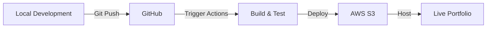

# 🚀 React Portfolio with AWS S3 Deployment


## 📋 Project Overview
A modern portfolio website built with React and Vite, featuring automated deployment through GitHub Actions to AWS S3. The project implements a robust CI/CD pipeline that automatically builds and deploys the latest changes when code is pushed to the main branch, ensuring seamless updates to the live portfolio.

## 🗂️ Project Structure
```
project-root/
├── 📁 src/
│   ├── 📁 components/
│   │   ├── 📄 hero_section.jsx
│   │   └── 📄 navigation_bar.jsx
│   ├── 📄 App.jsx
│   └── 📄 main.jsx
├── 📁 .github/
│   └── 📁 workflows/
│       └── 📄 deploy.yml
├── 📄 package.json
└── 📄 vite.config.js
```

## 🛠️ Technology Stack
- **Frontend**: React.js with Vite
- **CI/CD**: GitHub Actions
- **Deployment**: AWS S3
- **Node Version**: 18.x


## 🚀 Deployment Workflow

### GitHub Actions Configuration
```yaml
name: Deploy React App to S3

on:
  push:
    branches:
      - main  # Trigger deployment on push to the main branch

jobs:
  deploy:
    runs-on: ubuntu-latest

    steps:
      - name: Checkout repository
        uses: actions/checkout@v2

      - name: Set up Node.js
        uses: actions/setup-node@v2
        with:
          node-version: '18'

      - name: Install dependencies
        run: npm install

      - name: Clean npm cache
        run: npm cache clean --force

      - name: Build the app
        run: npm run build

      - name: Check if dist folder exists
        run: |
          if [ -d "./dist" ]; then
            echo "✅ Dist folder exists."
          else
            echo "❌ Dist folder does not exist. Build failed."
            exit 1
          fi

      - name: Set up AWS credentials
        uses: aws-actions/configure-aws-credentials@v1
        with:
          aws-access-key-id: ${{ secrets.AWS_ACCESS_KEY_ID }}
          aws-secret-access-key: ${{ secrets.AWS_SECRET_ACCESS_KEY }}
          aws-region: ${{ secrets.AWS_REGION }}

      - name: Sync dist folder to S3
        run: |
          aws s3 sync ./dist/ s3://cicd-react-deployment-demo/ --delete
```

## 🔧 Setup Guide

### Local Development
1. **Clone the repository**
   ```bash
   git clone <your-repository-url>
   cd <repository-name>
   ```

2. **Install dependencies**
   ```bash
   npm install
   ```

3. **Start development server**
   ```bash
   npm run dev
   ```

### AWS Configuration

1. **Create S3 Bucket**
   - Go to AWS S3 Console
   - Create a new bucket named `cicd-react-deployment-demo`
   - Enable static website hosting

2. **Bucket Policy**
   ```json
   {
       "Version": "2012-10-17",
       "Statement": [
           {
               "Sid": "PublicReadGetObject",
               "Effect": "Allow",
               "Principal": "*",
               "Action": "s3:GetObject",
               "Resource": "arn:aws:s3:::cicd-react-deployment-demo/*"
           }
       ]
   }
   ```

3. **GitHub Secrets**
   Required secrets in your GitHub repository:
   - `AWS_ACCESS_KEY_ID`
   - `AWS_SECRET_ACCESS_KEY`
   - `AWS_REGION`


## 🤝 Contributing
1. Fork the repository
2. Create your feature branch
3. Commit your changes
4. Push to the branch
5. Create a Pull Request

## 📄 License
This project is licensed under the MIT License.
